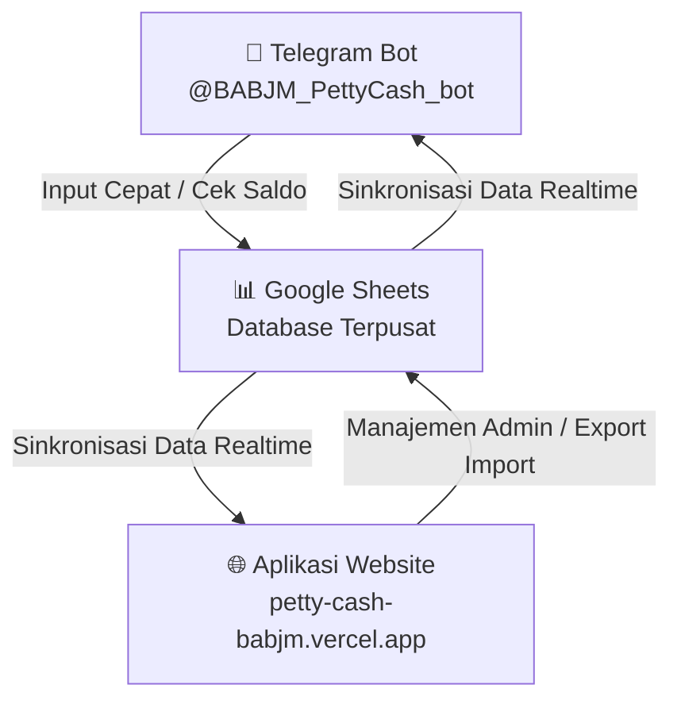

# 📖 MANUAL BOOK & PANDUAN OPERASIONAL PEMULA
## Sistem Keuangan Petty Cash & Bon Karyawan PT BABJM

> **Panduan Lengkap untuk Karyawan & Staf Baru PT BABJM**  
> Mengelola Kas Kecil (*Petty Cash*) & Kasbon Karyawan (*Bon*) secara terintegrasi via **Google Sheets**, **Aplikasi Website**, dan **Telegram Bot**.

---

### 🌐 Tautan Akses Ekosistem Aktif
* **Aplikasi Website**: [https://petty-cash-babjm.vercel.app](https://petty-cash-babjm.vercel.app)
* **Telegram Bot**: [https://t.me/BABJM_PettyCash_bot](https://t.me/BABJM_PettyCash_bot)
* **Username Bot**: `@BABJM_PettyCash_bot`

---

## 📊 GAMBARAN UMUM EKOSISTEM

Ekosistem Keuangan PT BABJM terdiri dari **3 Komponen Utama** yang saling terhubung secara real-time:



1. **Google Sheets (Database Terpusat)**: Spreadsheet penyimpanan utama seluruh log transaksi kas (`Cash_log`) dan pinjaman karyawan (`Bon_log`).
2. **Aplikasi Website (Pusat Kendali Admin)**: Antarmuka visual penuh untuk memantau dashboard, filter transaksi, edit massal, ekspor-impor Excel, dan mencetak laporan fisik PDF.
3. **Telegram Bot (Alat Input Cepat)**: Bot interaktif di hp/laptop untuk input transaksi instan, cek saldo, dan memantau kasbon aktif dari mana saja.

---

## 📗 MODUL 1: CARA PENGGUNAAN GOOGLE SHEETS (GSHEET)

Google Sheets berfungsi sebagai **database terpusat**. Seluruh input data dari Website maupun Telegram akan tersimpan otomatis di sini.

### 1. Structure Tab `Cash_log` (Buku Kas Kecil)
Tab ini mencatat seluruh arus uang kas masuk (Debit) dan kas keluar (Kredit).

```
+---+------------+------------+-------+--------------------+--------------------+------+--------+----------+----------+-------------+--------------+----------+
|   | A          | B          | C     | D                  | E                  | F    | G      | H        | I        | J           | K            | L        |
+---+------------+------------+-------+--------------------+--------------------+------+--------+----------+----------+-------------+--------------+----------+
| 1 | Tanggal    | Tgl. Nota  | Akun  | Keterangan Debit   | Keterangan Kredit  | PIC  | NO. ID | Debit    | Kredit   | Saldo Akhir | Tgl Penagih  | Catatan  |
+---+------------+------------+-------+--------------------+--------------------+------+--------+----------+----------+-------------+--------------+----------+
| 2 | 2026-08-01 |            |       | SALDO AWAL         |                    |      |        |          |          | 5000000     |              |          |
| 3 | 2026-08-02 | 2026-08-02 | ATK   |                    | Beli Kertas HVS    | Fita | K-001  |          | 150000   | 4850000     |              |          |
| 4 | 2026-08-03 | 2026-08-03 | Kas   | Pengisian Brankas  |                    | Admin| D-001  | 2000000  |          | 6850000     |              |          |
+---+------------+------------+-------+--------------------+--------------------+------+--------+----------+----------+-------------+--------------+----------+
```

* **Kolom A (Tanggal)**: Tanggal transaksi dilakukan (`YYYY-MM-DD`).
* **Kolom B (Tgl. Nota)**: Tanggal yang tertera pada nota fisik/kuitansi.
* **Kolom C (Akun)**: Kode/kategori pengeluaran (ATK, Konsumsi, Bensin, Logistik, dll.).
* **Kolom D (Keterangan Debit)**: Deskripsi penerimaan kas masuk.
* **Kolom E (Keterangan Kredit)**: Deskripsi pengeluaran kas keluar.
* **Kolom F (PIC)**: Nama penanggung jawab transaksi.
* **Kolom G (NO. ID)**: Kode unik / nomor transaksi.
* **Kolom H (Debit)**: Uang Kas Masuk (penerimaan).
* **Kolom I (Kredit)**: Uang Kas Keluar (pengeluaran).
* **Kolom J (Saldo Akhir)**: ⚠️ **AKUMULASI OTOMATIS**. *Jangan pernah mengetik di kolom J secara manual!*
* **Kolom K (Tgl. Penagihan)**: Tanggal jatuh tempo penagihan (opsional).
* **Kolom L (Lampiran/Catatan)**: Catatan tambahan / keterangan pendukung.

---

### 2. Structure Tab `Bon_log` (Buku Kasbon Karyawan)
Tab ini mencatat seluruh pinjaman sementara (bon) karyawan.

| Kolom A (ID BON) | Kolom B (Tanggal) | Kolom C (PIC) | Kolom D (Keterangan) | Kolom E (Nominal) | Kolom F (Status) |
|---|---|---|---|---|---|
| `BON-202608-001` | 2026-08-01 | Budi | Panjar Bensin Dinas | 300000 | `BELUM` |
| `BON-202608-002` | 2026-08-02 | Rio | Belanja Konsumsi Rapat | 150000 | `SUDAH` |

* **Status `BELUM`**: Kasbon belum diselesaikan (karyawan belum menyerahkan nota belanja).
* **Status `SUDAH`**: Kasbon sudah LUNAS (nota belanja riil sudah diserahkan).

---

### 3. Tab `Dashboard`
Tab visual tempat filter rentang tanggal dan grafik akumulasi kas.
> 💡 **Tips**: Jika visual tab `Dashboard` di GSheet teracak-acak, Anda dapat memperbaruinya otomatis dengan membuka menu **Extensions > Apps Script** di GSheet, lalu jalankan fungsi `setupGSheetDashboard()`.

---

## 🌐 MODUL 2: CARA PENGGUNAAN APLIKASI WEBSITE

Akses tautan: **[https://petty-cash-babjm.vercel.app](https://petty-cash-babjm.vercel.app)**

```
+-------------------------------------------------------------------------------+
|  🏦 PETTY CASH PT BABJM                                [ + Transaksi Baru ]   |
|  [ Dashboard ]  [ Transaksi ]  [ Bon ]  [ Laporan ]  [ Pengaturan ]           |
+-------------------------------------------------------------------------------+
|                                                                               |
|   +-----------------------+ +-----------------------+ +--------------------+  |
|   | 💵 SALDO KAS AKTIFF   | | 📈 NETTO BULAN INI    | | 📋 STATUS KASBON   |  |
|   | Rp 14.500.000         | | + Rp 2.500.000       | | 2 Bon Outstanding|  |
|   +-----------------------+ +-----------------------+ +--------------------+  |
+-------------------------------------------------------------------------------+
```

### 1. Halaman Dashboard
Halaman utama menyajikan 3 Ringkasan Metrik Keuangan:
1. **Saldo Kas Aktif**: Total dana tunai yang saat ini tersedia di brankas kas kecil.
2. **Netto Bulan Ini**: Pemasukan (Debit) dikurangi Pengeluaran (Kredit) dalam bulan berjalan.
3. **Status Kasbon**: Jumlah kasbon luar (*outstanding*) beserta indikator usia kasbon:
   * 🟢 **Normal (1-9 Hari)**: Kasbon dalam batas wajar.
   * 🟡 **Warning (10-13 Hari)**: Mendekati batas jatuh tempo 14 hari.
   * 🔴 **Overdue (≥ 14 Hari)**: Melebihi 14 hari, wajib ditagih ke karyawan terkait.

---

### 2. Halaman Transaksi (Input Kas & Grid Mode)

#### A. Entri Transaksi Baru (Single Input)
1. Klik tombol **`+ Transaksi Baru`** di pojok kanan atas.
2. Isi formulir:
   * **Tanggal Transaksi** & **Tgl. Nota**
   * **Akun Pengeluaran** (misal: *ATK, Konsumsi, Logistik, Bensin*)
   * **Jenis Kas**: Pilih `Debit` (Kas Masuk) atau `Kredit` (Kas Keluar)
   * **Nominal** (masukkan angka tanpa titik/koma)
   * **PIC & Keterangan Detail**
3. Klik **Simpan**.

#### B. Mode Edit Banyak Data (Grid Edit Mode)
1. Centang kotak di samping baris-baris transaksi yang ingin diubah pada tabel.
2. Klik tombol **`Edit Grid Mode`** pada baris aksi melayang di bagian bawah.
3. Tabel akan berubah menjadi sel interaktif (seperti Excel). Ubah teks/angka yang diinginkan.
4. Klik **Simpan Perubahan**.

---

### 3. Fitur Impor/Ekspor Excel & Cetak PDF

#### A. Impor Excel (Unggah Massal)
1. Klik tombol **`Import`**.
2. Download templat Excel resmi. Perhatikan aturan warna kolom:
   * 🔴 **Merah**: Wajib diisi (*Tanggal*).
   * 🟡 **Kuning**: Diisi sesuai transaksi (*Keterangan & Nominal Debit/Kredit*).
   * 🔵 **Biru**: Opsional (*Tgl. Nota, Akun, PIC, No. ID*).
   * ⚪ **Abu-abu**: Dibiarkan kosong (*Saldo Akhir otomatis*).
3. Unggah file Excel yang sudah diisi, lalu klik **Proses Import**.

#### B. Cetak Laporan PDF Resmi
1. Klik tombol **`Cetak PDF`**.
2. Tampilan web akan otomatis menyesuaikan menjadi format cetak bersih dan memunculkan **Kotak Tanda Tangan Resmi**:

```
  Disiapkan Oleh:             Diperiksa Oleh:             Disetujui Oleh:


  ( Admin Keuangan )          ( Supervisor )              ( Pimpinan/Direktur )
```

---

### 4. Halaman Bon (Pelunasan & Rekonsiliasi Automatic Settle)
Saat karyawan menyerahkan nota belanja riil dari kasbon yang dipegang:
1. Masuk ke halaman **Bon**.
2. Klik tombol **`Lunas`** di baris bon karyawan terkait.
3. Masukkan **Nominal Belanja Nota Riil**:
   * **Kasus 1 (Belanja = Kasbon)**: Bon langsung Lunas.
   * **Kasus 2 (Belanja < Kasbon / Sisa Uang dikembalikan)**: Bon Lunas, dan sistem **OTOMATIS** menambahkan transaksi *Kas Masuk (Debit)* sebesar sisa uang di Halaman Transaksi.
   * **Kasus 3 (Belanja > Kasbon / Kurang diganti Admin)**: Bon Lunas, dan sistem **OTOMATIS** menambahkan transaksi *Kas Keluar (Kredit)* sebesar kekurangan uang di Halaman Transaksi.

---

## 📱 MODUL 3: CARA KONEKSI & PENGGUNAAN TELEGRAM BOT

Telegram Bot adalah cara tercepat untuk input transaksi dari handphone.

```
+-------------------------------------------------------+
|  🤖 BABJM Petty Cash Bot                              |
|  @BABJM_PettyCash_bot                                 |
+-------------------------------------------------------+
|  Halo Admin! Pilih menu transaksi di bawah ini:       |
|                                                       |
|  [ 🟢 Kas Masuk ]     [ 🔴 Kas Keluar ]               |
|  [ 📋 Bon Baru  ]     [ 🔍 Monitor Bon ]              |
|  [ 💳 Cek Saldo ]     [ 📊 Rekap Transaksi ]          |
+-------------------------------------------------------+
```

### 1. Cara Menghubungkan Bot Pertama Kali
1. Buka aplikasi **Telegram** di smartphone atau laptop Anda.
2. Cari username: **`@BABJM_PettyCash_bot`**
3. Klik tombol **`START`** (atau ketik `/start`).
4. Bot akan memberikan balasan dan memunculkan **Persistent Keyboard Menu** (6 Tombol Interaktif di bawah layar).

---

### 2. Penggunaan 6 Tombol Keyboard Interaktif
* 🟢 **Kas Masuk**: Menuntun Anda mencatat Kas Masuk (Debit).
* 🔴 **Kas Keluar**: Menuntun Anda mencatat Kas Keluar (Kredit).
* 📋 **Bon Baru**: Menuntun Anda membuat Kasbon karyawan baru.
* 🔍 **Monitor Bon**: Menampilkan daftar seluruh kasbon karyawan yang belum lunas.
* 💳 **Cek Saldo**: Menampilkan saldo brankas kas kecil terkini.
* 📊 **Rekap Transaksi**: Menampilkan ringkasan 5 transaksi kas terakhir.

---

### 3. Smart Nominal Parser (Format Penulisan Pesan Teks Cepat)
Anda dapat menulis angka nominal menggunakan singkatan sehari-hari:
* `rb` atau `k` = Ribuan *(contoh: `50rb` / `50k` = 50.000)*
* `jt` atau `juta` = Jutaan *(contoh: `1.5jt` / `1.5juta` = 1.500.000)*

#### Contoh Pesan Teks:
```text
Kas Keluar : 120rb Beli konsumsi rapat operasional
Kas Masuk  : 2.5jt Pengisian ulang brankas dari kantor pusat
Bon Baru   : Rian 300k Panjar bensin & tol dinas luar
```

---

### 4. Perintah Chat Langsung (Direct Slash Commands)
Anda juga bisa langsung mengetik perintah berikut di kolom chat:

| Perintah | Deskripsi | Contoh |
|---|---|---|
| `/saldo` | Cek saldo brankas real-time | `/saldo` |
| `/rekap` | Rekap 5 transaksi terakhir | `/rekap` |
| `/monitor` | Cek daftar kasbon belum lunas | `/monitor` |
| `/kas` | Input kas 1 baris chat | `/kas kredit 75k Beli ATK Kertas HVS` |
| `/bon` | Input bon 1 baris chat | `/bon Fita 200k Panjar Beli Banner` |
| `/lunas` | Pelunasan bon manual | `/lunas BON-202608-001` |

---

### 5. Fitur Tautan Biru Pelunasan Sekali Klik (Clickable Links)
Saat Anda mengetik `/monitor`, bot akan menampilkan daftar bon disertai link biru `/lunas_BON_xxx`:

> 📋 **Daftar Kasbon Active:**  
> 1. **Fita** - Rp 200.000 (Panjar Banner)  
>    👉 Klik untuk melunasi: `/lunas_BON_202608_001`

**Cara Pakai**: Cukup sentuh/klik teks biru `/lunas_BON_202608_001` di Telegram. Bon akan **langsung LUNAS secara instan**!

---

### 6. Pengingat Otomatis Harian (Daily Auto-Reminder)
Setiap hari kerja pukul **08:00 WIB**, sistem secara otomatis mengirimkan daftar kasbon yang mendekati atau melewatu jatuh tempo 14 hari ke grup Telegram sebagai penagihan harian.

---

## ❓ TROUBLESHOOTING & FAQ (UNTUK STAF BARU)

* **Q: Saya salah menginput nominal di Telegram, bagaimana cara mengeditnya?**  
  *A: Buka Aplikasi Web di Halaman Transaksi, cari transaksi tersebut, lalu klik tombol Edit di sebelah kanan.*

* **Q: Tombol keyboard di Telegram tiba-tiba hilang/tertutup keyboard biasa?**  
  *A: Ketik `/start` di chat bot Telegram untuk mengaktifkan kembali Persistent Keyboard Menu.*

* **Q: Apakah data di Telegram, Web, dan GSheet sama?**  
  *A: Ya! Ketiganya terhubung ke database Google Sheets yang sama secara real-time.*

---

*Manual Book v2.0 — PT BERKAH AMANAH BERSAMA JAYA MAKMUR (PT BABJM)*
